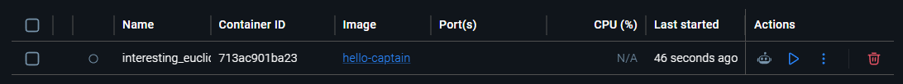
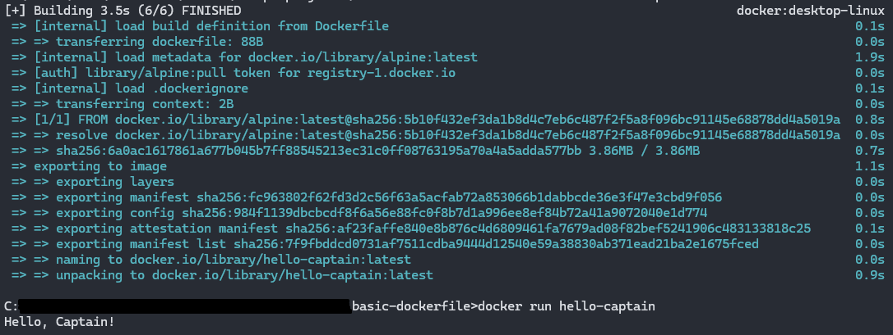

# Basic Dockerfile

A minimal Dockerfile using Alpine Linux that prints a greeting to the console.

## Usage

```bash
docker build -t hello-captain .
docker run hello-captain
```
To use a custom name:

```bash
docker run -e NAME=type_your_name_here hello-captain
```

"-e" sets an environment variable inside the container so -e NAME="Name" is like saying "inside this container, the variable NAME equals the users input".



This project is part of [roadmap.sh](https://roadmap.sh/projects/github-actions-deployment-workflow) DevOps projects.
