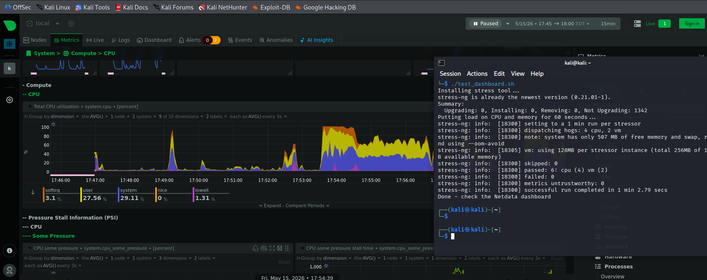

# Simple Monitoring with Netdata

Setting up a basic monitoring dashboard using Netdata on Linux to track CPU, memory, disk and network usage in real time.


## Setup

Run the setup script to install and start Netdata:

```bash
chmod +x setup.sh
./setup.sh
```

Access the dashboard at `http://localhost:19999`

## Load Testing

Run the stress test to put load on the system and see it reflected on the dashboard:

```bash
./test_dashboard.sh
```

## Cleanup

To remove Netdata from the system:

```bash
./cleanup.sh
```

## Alerts

Configured a CPU alert that warns at 80% usage and goes critical at 95%, defined in `/etc/netdata/health.d/cpu.conf`.

This project is part of [roadmap](https://roadmap.sh/projects/simple-monitoring-dashboard) DevOps projects.
https://roadmap.sh/projects/simple-monitoring-dashboard
