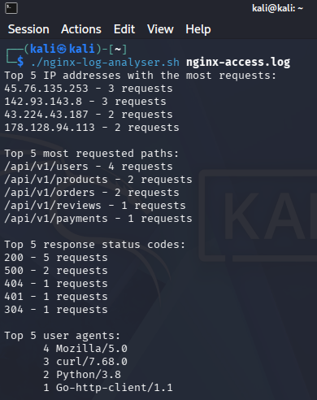
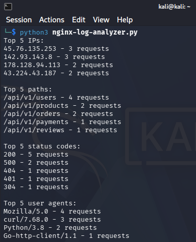

# Nginx Log Analyser

A tool to analyse nginx access logs from the command line. Shows top 5 IP addresses, requested paths, response status codes and user agents by request count.

## Usage

Bash:

```bash

chmod +x nginx-log-analyser.sh

./nginx-log-analyser.sh nginx-access.log

```

Python:

```bash

python3 nginx-analyser.py

```




This project is part of [roadmap.sh](https://roadmap.sh/projects/nginx-log-analyser) DevOps projects.
